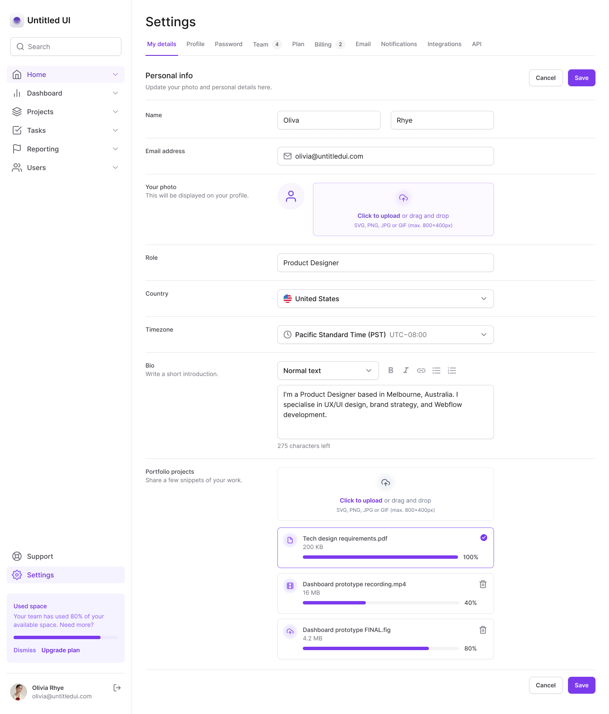

 Status: Completo ✅

## Tailwind UI 
Uma aplicação voltada aos meus estudos com tailwind.

<hr/>
<br/>

<center>
 <div></div>
</center>
<br/>
<hr/>

## Tecnologias Utilizadas:

 * Next
 * Tailwind
 * tailwind-variants
 * tailwind-merge
 * next-themes
 * lucide-react
 * framer-motion
 * radix-ui
 * auto-animate

## Instalação
  * Faça um clone do repositório do projeto no GitHub.
  * Navegue até o diretório do projeto.
  * Execute o seguinte comando para instalar as dependências:

```
$ pnpm install
```

## Running the project
```
$ pnpm run dev
```


